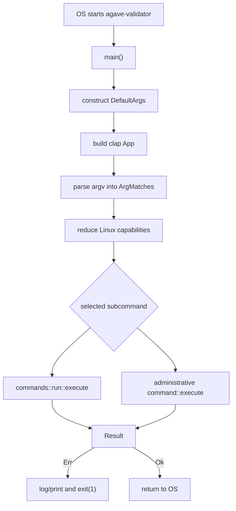
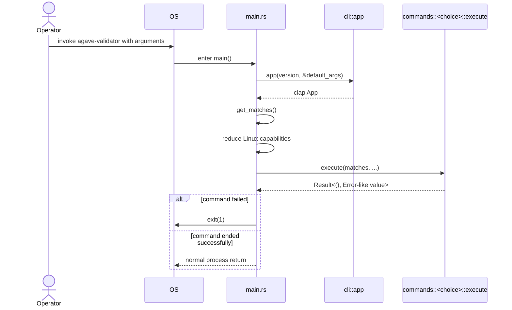

# Lesson 01 — The Validator as a Process

> **Source baseline:** [handbook Agave version](../README.md#agave-version) at commit `3b1b239ce2ae3868dce17ff0e06fd0ac32313592`  
> **Version note:** this boundary may evolve in later versions; the links below remain fixed to the studied implementation.

## Current Position

```text
Agave validator
├── Process entry and command dispatch ✅ ← YOU ARE HERE
├── Validator initialization
├── Networking
├── TPU
│   ├── Fetch
│   ├── SigVerify
│   └── Banking
│       ├── Scheduler
│       ├── Account Locks
│       ├── Sealevel
│       └── SVM
├── Broadcast
├── TVU
└── Consensus
```

We are at the outermost operating-system boundary, before validator initialization and before any transaction pipeline exists.

## Learning objective

By the end, you should be able to open the official [`validator/src/main.rs`](https://github.com/anza-xyz/agave/blob/3b1b239ce2ae3868dce17ff0e06fd0ac32313592/validator/src/main.rs) and explain how operating-system input becomes one selected validator command. You are **not** expected to understand how the validator services work yet.

## 1. What problem does this solve?

A validator repository contains networking, execution, storage, and consensus code, but an operating system cannot start “an architecture.” It starts an executable. The executable needs one controlled boundary that:

- establishes process-wide behavior;
- turns command-line text into typed choices;
- retains only needed OS privileges;
- routes exactly one command;
- turns success or failure into an OS exit status.

That boundary is [`validator/src/main.rs`](https://github.com/anza-xyz/agave/blob/3b1b239ce2ae3868dce17ff0e06fd0ac32313592/validator/src/main.rs).

## 2. Why does Solana need this?

A production validator is both a long-running node and an operator tool. The same executable can run a node or issue administrative commands such as `monitor`, `exit`, and `set-identity`. Central dispatch ensures those modes share argument validation and failure behavior without accidentally starting validator services for an administrative command.

**Real-world analogy:** `main.rs` is an airport's controlled entrance, not an aircraft engine. It reads the passenger's destination, applies facility-wide security policy, directs the passenger to exactly one gate, and handles rejection. TPU, replay, and runtime are machinery beyond a particular gate; they do not belong in the entrance.

## 3. High-level architecture

```text
operator / service manager
          |
          | argv + environment + OS capabilities
          v
 validator/src/main.rs
   |      |        |
   |      |        +-- define final error/exit behavior
   |      +----------- select one command
   +------------------ establish process policy
          |
          v
 validator/src/commands/<selected command>
```



## 4. Execution flow



This is deliberately not the transaction pipeline. A transaction does not pass through `main`; `main` constructs or invokes the long-lived system that later receives transactions.

## 5. Repository Explorer

### Relevant folders and files

```text
validator/
├── Cargo.toml                  package named agave-validator
└── src/
    ├── main.rs                 executable boundary studied now
    ├── lib.rs                  reusable validator-crate modules/helpers
    ├── cli.rs                  constructs the command-line grammar
    └── commands/
        ├── mod.rs              exposes command modules + shared error type
        └── run/
            ├── mod.rs          exposes add_args and execute
            └── execute.rs      startup implementation (later lesson)
```

The Cargo package is named `agave-validator` in [`validator/Cargo.toml`](https://github.com/anza-xyz/agave/blob/3b1b239ce2ae3868dce17ff0e06fd0ac32313592/validator/Cargo.toml). In Rust source, hyphens become underscores, so the library is imported as `agave_validator`.

Why each file is relevant:

- [`validator/Cargo.toml`](https://github.com/anza-xyz/agave/blob/3b1b239ce2ae3868dce17ff0e06fd0ac32313592/validator/Cargo.toml) establishes which package and binary the OS ultimately runs.
- [`validator/src/main.rs`](https://github.com/anza-xyz/agave/blob/3b1b239ce2ae3868dce17ff0e06fd0ac32313592/validator/src/main.rs) owns the boundary studied in this lesson.
- [`validator/src/lib.rs`](https://github.com/anza-xyz/agave/blob/3b1b239ce2ae3868dce17ff0e06fd0ac32313592/validator/src/lib.rs) exposes the library modules that the binary imports.
- [`validator/src/cli.rs`](https://github.com/anza-xyz/agave/blob/3b1b239ce2ae3868dce17ff0e06fd0ac32313592/validator/src/cli.rs) defines the grammar that makes dispatch patterns valid.
- [`validator/src/commands/mod.rs`](https://github.com/anza-xyz/agave/blob/3b1b239ce2ae3868dce17ff0e06fd0ac32313592/validator/src/commands/mod.rs) exposes destinations and their shared error type.
- [`validator/src/commands/run/mod.rs`](https://github.com/anza-xyz/agave/blob/3b1b239ce2ae3868dce17ff0e06fd0ac32313592/validator/src/commands/run/mod.rs) shows why `commands::run::execute` is available at that path.

### Intentionally ignored

- `core/`: owns major validator services, but those services have not been constructed at this boundary.
- `runtime/` and `svm/`: transaction execution is downstream and outside this lesson.
- `ledger/`: ledger storage behavior is downstream; only the path value is relevant here.
- `gossip/`, `turbine/`, and `streamer/`: networking does not participate in command selection.
- the body of [`validator/src/commands/run/execute.rs`](https://github.com/anza-xyz/agave/blob/3b1b239ce2ae3868dce17ff0e06fd0ac32313592/validator/src/commands/run/execute.rs): it is the next architectural boundary, not part of process dispatch.

These areas are ignored to preserve scope, not because they are unimportant.

## 6. Code navigation

- **Who calls this file?** The Rust startup runtime enters `main()` after the OS loads the executable.
- **Which files call into it?** Repository source does not call `main`; it is an executable entry point.
- **What does it call?** `cli::app`, Clap parsing, Linux capability APIs, and exactly one `commands::*::execute` handler.
- **Input origin:** process arguments and platform capability state.
- **Output destination:** one command handler, followed by normal return or OS status 1.
- **Ownership:** `main` owns defaults, parsed matches, the ledger `PathBuf`, and run configuration; handlers mostly borrow parsed data and the path.
- **Responsibility:** process policy and routing. It does not own transaction processing, networking, runtime execution, or consensus.

Continue within this lesson in this order: [architecture.md](architecture.md), [code-walkthrough.md](code-walkthrough.md), [glossary.md](glossary.md), [exercises.md](exercises.md), then [Quiz.md](Quiz.md).

## Summary

[`validator/src/main.rs`](https://github.com/anza-xyz/agave/blob/3b1b239ce2ae3868dce17ff0e06fd0ac32313592/validator/src/main.rs) converts operating-system process input into one command invocation under a process-wide allocator, platform-specific privilege policy, and shared failure boundary. It is the doorway to the validator, not the validator's transaction architecture.

## Official Code

- [Validator package directory](https://github.com/anza-xyz/agave/tree/3b1b239ce2ae3868dce17ff0e06fd0ac32313592/validator)
- [`main()` and command dispatch](https://github.com/anza-xyz/agave/blob/3b1b239ce2ae3868dce17ff0e06fd0ac32313592/validator/src/main.rs#L17-L138)
- [`cli::app()` and subcommand grammar](https://github.com/anza-xyz/agave/blob/3b1b239ce2ae3868dce17ff0e06fd0ac32313592/validator/src/cli.rs#L54-L85)
- [`commands` modules and shared error boundary](https://github.com/anza-xyz/agave/blob/3b1b239ce2ae3868dce17ff0e06fd0ac32313592/validator/src/commands/mod.rs#L1-L42)
- [`commands::run::Config`](https://github.com/anza-xyz/agave/blob/3b1b239ce2ae3868dce17ff0e06fd0ac32313592/validator/src/commands/run/mod.rs#L6-L9)

## Official Sources

- **Agave source:** the official code links above are the primary evidence for this lesson.
- **Pull requests/issues:** none required for this process-boundary lesson.
- **Anza/Solana documentation:** none required; no protocol behavior is taught here.
- **SIMDs/RFCs:** not applicable.
- **Research papers:** not applicable.

## STOP HERE

Complete the quiz, write questions and exercise answers, and review the common misconceptions in `architecture.md`. Do not enter validator initialization or create Lesson 02 until you explicitly choose to continue.
