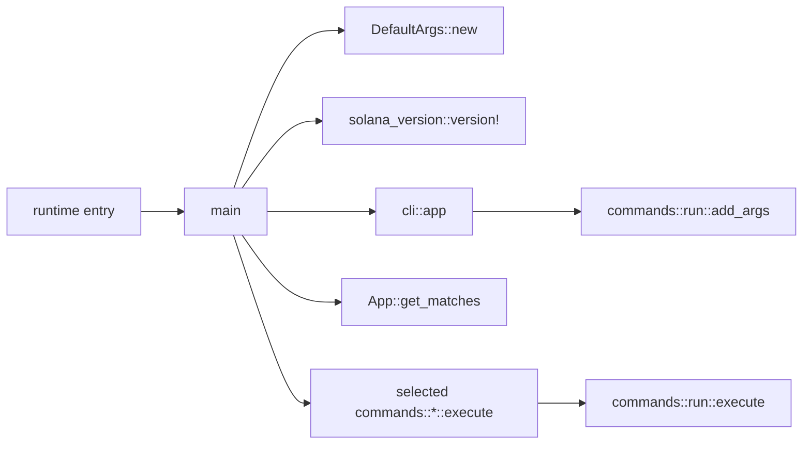
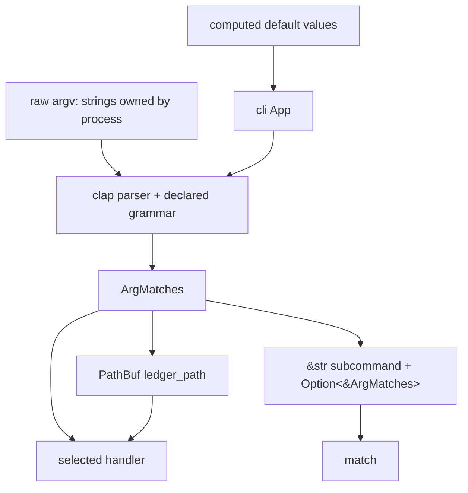

# Architecture Boundary

## Call graph



`main` calls these functions synchronously on the initial thread. The many validator worker threads are created deeper in startup, outside this lesson.

## Data-flow diagram



## Memory and ownership sketch

```text
main stack frame
├── default_args: DefaultArgs             owns computed defaults
├── solana_version: &str                  version macro supplies a string reference
├── cli_app: clap::App                    owns CLI grammar until consumed
├── matches: clap::ArgMatches             owns parsed match data
├── ledger_path: PathBuf                  owns a copied path buffer
├── subcommand: &str --------------------- borrows from matches
└── maybe_subcommand_matches: Option<&ArgMatches>
                         ---------------- borrows from matches
```

`&default_args` is a shared borrow: `app` can read defaults but does not take ownership. `get_matches()` consumes `cli_app`; the grammar has done its job and the parsed `matches` becomes the useful value. `PathBuf::from(...)` creates an owned path so later command calls can borrow it as `&ledger_path`.

## Failure boundary

Handlers return a `Result`: either success or an error value. The final `unwrap_or_else` is not a blind panic. It explicitly prints the error and calls `exit(1)`, producing a conventional non-zero failure status. Earlier `unwrap()` and `expect()` calls express stronger invariants: the CLI grammar promises `ledger_path`, and the code treats inability to manipulate expected Linux capability sets as fatal.

## Performance boundary

The global allocator is selected before `main` runs. Allocation behavior is process-wide, so placing `#[global_allocator]` on a static is appropriate. CLI parsing itself is startup work and not transaction hot-path work. Do not infer transaction throughput properties from this file.

## Security boundary

On Linux, the process clears ambient and inheritable capabilities. For `run`/default mode it retains `CAP_DAC_OVERRIDE` only if already both permitted and effective; other subcommands clear effective and permitted capabilities. This follows least privilege and reduces the authority carried into administrative code paths.

## Common misconceptions

1. **“`main.rs` is the validator architecture.”** It is the process entry and dispatcher.
2. **“The `run` arm executes one transaction.”** It begins a long-lived validator startup path.
3. **“Every `unwrap` is automatically a bug.”** It may mark an invariant, though invariants still deserve review.
4. **“`&PathBuf` transfers the path.”** `&` borrows; ownership stays in `main`.
5. **“`#[cfg]` is a runtime `if`.”** It includes or excludes code at compilation time.

