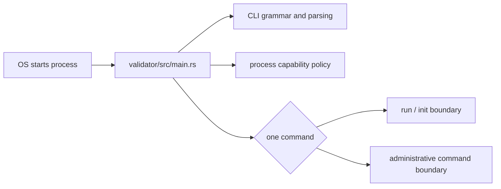

# Validator Architecture — Established So Far

## Proven boundary

The completed lesson proves only this outer process boundary. Validator service initialization, networking, TPU, TVU, execution, storage, and consensus remain intentionally unopened.

## Responsibility

The entry point owns process policy and routing. It does not process transactions or implement a validator subsystem.

## Source evidence

- [`validator/src/main.rs`](https://github.com/anza-xyz/agave/blob/3b1b239ce2ae3868dce17ff0e06fd0ac32313592/validator/src/main.rs)
- [`validator/src/cli.rs` app and subcommands](https://github.com/anza-xyz/agave/blob/3b1b239ce2ae3868dce17ff0e06fd0ac32313592/validator/src/cli.rs#L54-L85)
- [`validator/src/commands/mod.rs`](https://github.com/anza-xyz/agave/blob/3b1b239ce2ae3868dce17ff0e06fd0ac32313592/validator/src/commands/mod.rs)
