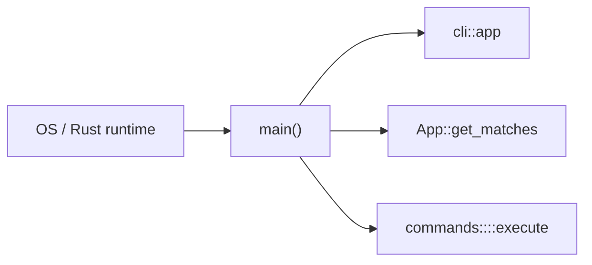

# Validator Main

> **Source baseline:** [handbook Agave version](../README.md#agave-version) at commit `3b1b239ce2ae3868dce17ff0e06fd0ac32313592`.

## Purpose

Defines the `agave-validator` process boundary: process-wide allocator choice, CLI parsing, Linux capability reduction, command dispatch, and final error-to-exit behavior.

## Relevant files

- [`validator/src/main.rs`](https://github.com/anza-xyz/agave/blob/3b1b239ce2ae3868dce17ff0e06fd0ac32313592/validator/src/main.rs) — executable entry point and dispatcher.
- [`validator/src/cli.rs`](https://github.com/anza-xyz/agave/blob/3b1b239ce2ae3868dce17ff0e06fd0ac32313592/validator/src/cli.rs) — constructs the accepted CLI grammar used by `main`.
- [`validator/src/commands/mod.rs`](https://github.com/anza-xyz/agave/blob/3b1b239ce2ae3868dce17ff0e06fd0ac32313592/validator/src/commands/mod.rs) — exposes handlers and their shared error/result boundary.
- [`validator/src/commands/run/mod.rs`](https://github.com/anza-xyz/agave/blob/3b1b239ce2ae3868dce17ff0e06fd0ac32313592/validator/src/commands/run/mod.rs) — re-exports run argument construction and execution.
- [`validator/Cargo.toml`](https://github.com/anza-xyz/agave/blob/3b1b239ce2ae3868dce17ff0e06fd0ac32313592/validator/Cargo.toml) — defines the `agave-validator` package and default binary.

## Entry points

- [`main()`](https://github.com/anza-xyz/agave/blob/3b1b239ce2ae3868dce17ff0e06fd0ac32313592/validator/src/main.rs#L17-L138) — called by the Rust runtime after OS process startup.
- [`cli::app(...)`](https://github.com/anza-xyz/agave/blob/3b1b239ce2ae3868dce17ff0e06fd0ac32313592/validator/src/cli.rs#L54-L85) — creates the Clap application consumed by `main`.
- [`commands::<selected>::execute(...)` dispatch](https://github.com/anza-xyz/agave/blob/3b1b239ce2ae3868dce17ff0e06fd0ac32313592/validator/src/main.rs#L75-L133) — selects one handler.

## Call graph

## Dependencies

- Clap for command grammar and parsed matches.
- `caps` on Linux for process capability sets.
- jemalloc on supported targets as the global allocator.
- `log` for run/initialize failure reporting.

## Related modules

- [`validator::commands`](https://github.com/anza-xyz/agave/tree/3b1b239ce2ae3868dce17ff0e06fd0ac32313592/validator/src/commands) owns individual operator-command implementations.
- [`validator::commands::run`](https://github.com/anza-xyz/agave/tree/3b1b239ce2ae3868dce17ff0e06fd0ac32313592/validator/src/commands/run) is the bridge into validator initialization; its internals are not indexed until studied.

## Important structs

- [`DefaultArgs`](https://github.com/anza-xyz/agave/blob/3b1b239ce2ae3868dce17ff0e06fd0ac32313592/validator/src/cli.rs) — owns computed CLI defaults; fields deferred to a later lesson.
- [`commands::run::Config`](https://github.com/anza-xyz/agave/blob/3b1b239ce2ae3868dce17ff0e06fd0ac32313592/validator/src/commands/run/mod.rs#L6-L9) — carries the reduced capability set on Linux.
- `clap::ArgMatches` — owns parsed CLI matches.
- `PathBuf` — owns the ledger path copied from parsed input.

## Important traits

No trait is declared by `main.rs`. Iterator/collection implementations support capability-set intersection and reconstruction. Detailed trait mechanics are deferred until required by studied code.

## Ownership and failure notes

`main` owns defaults, parsed matches, and the ledger path. Handlers generally borrow parsed data and the path. Handler errors converge at the final `unwrap_or_else`, which prints and exits with status 1.
